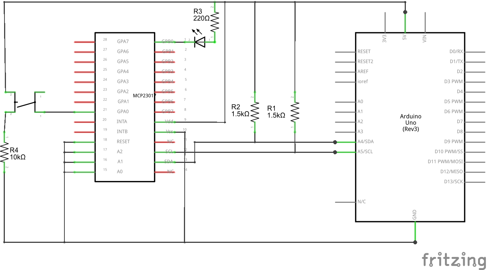
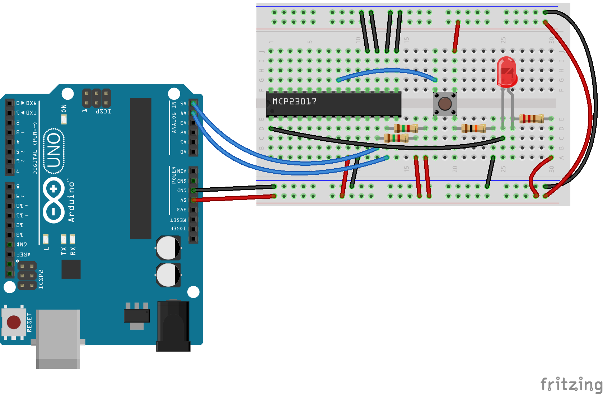

# MCP23017 Input Example

This example should help you getting started with the MCP23017 IC and this library.

It shows you how to use a pin as input and how to use a pin as output

## Purpose

The fancy art of turning a LED on and off

## Schematic

## Wiring

- Connect A0 - A3 (pins 15-17) to ground  
- Connect RESET (pin 18) to ground  
- Connect Vss (pin 10) to ground  
- Connect SCL (pin 12) with A5 of Arduino (other Arduino may have a different pin)
- Connect SDA (pin 13) with A4 of Arduino (other Arduino may have a different pin)
- Pull-up SCL and SDA with a 1.5K Ohm Resistor to +5V
- Place a push button on your breadboard an connect it with GPA0 (pin 21)
- On the other side of the button connect it with +5V and a high level pull-down resistor (i.e. 10K Ohm) to ground
- Place a LED on your breadboard and connect the catode (short leg) with GPB0 (pin 1)
- Connect the other leg to +5V using a current limiting resistor (i.e. 220 Ohm for a standard red LED)
- Connect Vdd (pin 9) to +5V

## Code

[MCP23017_input.ino](MCP23017_input.ino "MCP23017_input.ino")